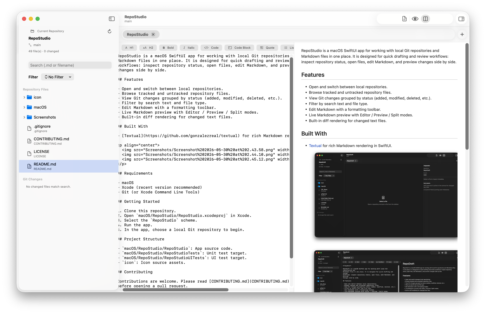
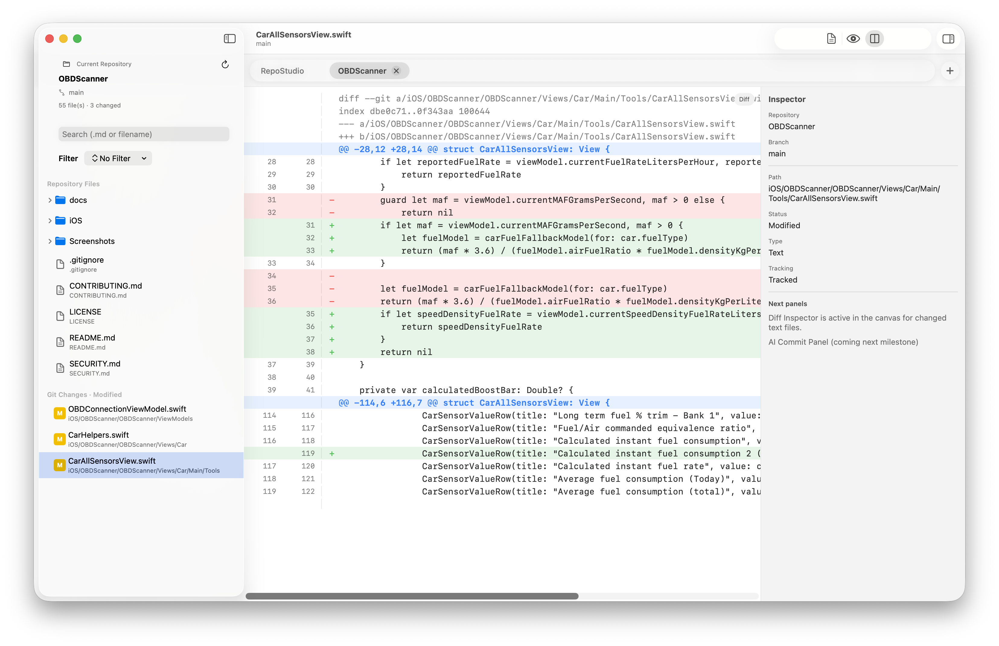
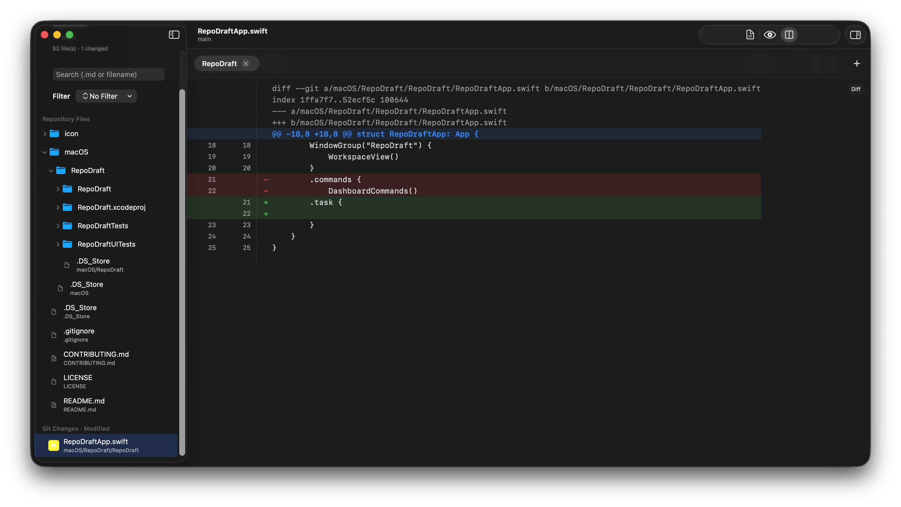

<h1 align="center">MarkText</h1>

  <!-- License -->
  

  <h3>
    <a href="https://repo-studio.com">
      Website
    </a>
  </h3>

  

    

RepoStudio is a macOS SwiftUI app for working with local Git repositories and
Markdown files in one place. It is designed for quick drafting and review
workflows: inspect repository status, open files, edit Markdown, and preview
changes side by side.

## Features

- Open and switch between local repositories.
- Browse tracked and untracked repository files.
- View Git changes grouped by status (added, modified, deleted, etc.).
- Filter by search text and file type.
- Edit Markdown with a formatting toolbar.
- Live Markdown preview with Editor / Preview / Split modes.
- Built-in diff rendering for changed text files.

## Built With

- [Textual](https://github.com/gonzalezreal/textual) for rich Markdown rendering in SwiftUI.

  
  
  

## Requirements

- macOS
- Xcode (recent version recommended)
- Git (or Xcode Command Line Tools)

## Getting Started

1. Clone this repository.
2. Open `macOS/RepoStudio/RepoStudio.xcodeproj` in Xcode.
3. Select the `RepoStudio` scheme.
4. Run the app.
5. In the app, choose a local Git repository to begin.

## Project Structure

- `macOS/RepoStudio/RepoStudio`: App source code.
- `macOS/RepoStudio/RepoStudioTests`: Unit test target.
- `macOS/RepoStudio/RepoStudioUITests`: UI test target.
- `icon`: Icon source assets.

## Contributing

Contributions are welcome. Please read [CONTRIBUTING.md](CONTRIBUTING.md)
before opening a pull request.

## License

This project uses a custom license:
[RepoStudio Community License v1.0](LICENSE)
